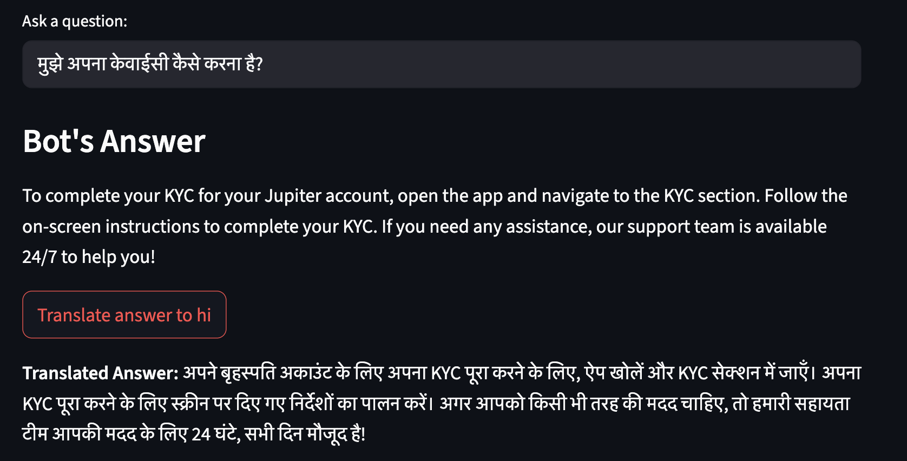
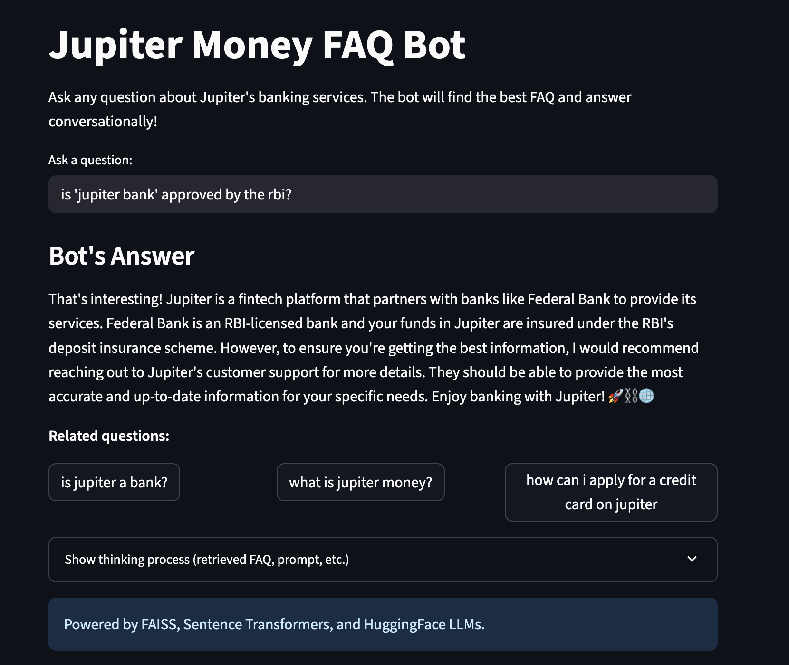

# Jupiter Money FAQ Bot

A human-friendly FAQ bot for Jupiter's Help Centre, built with Python, FAISS for semantic search, and open-source LLM Mistral. The bot scrapes FAQs from Jupiter's help and community pages, preprocesses them, and provides conversational answers via a web app frontend using streamlit.

---

## 🚀 Live Demo
**Try it here:** [https://jupiter-faq-bot.streamlit.app/](https://jupiter-faq-bot.streamlit.app/)

---

## Features
- Scrapes and structures FAQs from Jupiter's help page
- Cleans, deduplicates, and categorizes Q&A pairs
- Semantic search using FAISS and sentence-transformers
- Conversational answers using open-source LLMs (via HuggingFace Inference API)
- Modern web app frontend (Streamlit)
- Related query suggestions (bonus)
- "Show thinking process" expandable section for transparency including retrieved FAQ and system prompt.
- RAG vs. LLM comparison notebook and results (bonus)
- Multilingual support (bonus): Ask questions in Hindi, French, or other languages, and get answers in your preferred language.

---

## 📸 Demo Screenshots

### 1. Multilingual Input (Hindi to English)

*The bot understands a Hindi query and answers in English by default.*

### 2. Multilingual Output (Hindi Translation)

*User clicks "Translate answer to hi" and receives the answer in Hindi.*

### 3. Multilingual Output (French Translation)

*User clicks "Translate answer to fr" and receives the answer in French.*

### 4. Final Output

*Standard English answer output.*

### 5. Related Query Suggestions

*Shows clickable related questions for easy exploration.*

### 6. Thinking Process (Expandable)

*Expandable section reveals the retrieved FAQ and system prompt for transparency.*

---

## 🛠️ Setup

1. **Clone the repo and navigate to the project directory:**
   ```bash
   git clone https://github.com/sanya21561/FAQ-Bot
   cd FAQ-Bot
   ```
2. **Create and activate a virtual environment:**
   ```bash
   python3 -m venv venv
   source venv/bin/activate
   ```
3. **Install dependencies:**
   ```bash
   pip install -r requirements.txt
   ```
4. **Set your HuggingFace API key:**
   ```bash
   export HF_API_KEY=your_actual_huggingface_api_key
   ```
5. **Run the app:**
   ```bash
   streamlit run app.py
   ```

---

## 🧠 Architecture & Methodology

- **Scraping:**
  - Extracts Q&A pairs from Jupiter's FAQ/help pages using BeautifulSoup and requests.
  - Data is structured as question–answer pairs and saved as JSON for further processing.

- **Preprocessing:**
  - Cleans, normalizes (lowercases, strips whitespace), and deduplicates questions.
  - Ensures each question is unique and answers are concise.

- **Semantic Search (FAISS):**
  - Uses the `sentence-transformers` model `all-MiniLM-L6-v2` to embed all FAQ questions.
  - Embeddings are indexed with FAISS for fast similarity search.
  - At query time, the user's question is embedded and the most semantically similar FAQ is retrieved.

- **RAG Pipeline:**
  - The user query and the best-matching FAQ (from FAISS) are combined into a prompt.
  - This prompt is sent to the LLM (Mistral-7B-Instruct-v0.2 via HuggingFace Inference API) to generate a conversational, context-aware answer.
  - Only the final answer is shown to the user; the prompt and FAQ context are available in an expandable "thinking process" section.

- **Multilingual Support:**
  - The app detects the input language using `langdetect`.
  - If the query is not in English, it is translated to English using the `translate` package before running through the RAG pipeline.
  - The answer is shown in English by default.
  - If the original query was not in English, a button appears to translate the answer back to the user's language (e.g., Hindi, French).
  - This makes the bot accessible to users in multiple languages and demonstrates true multilingual capability.

- **Frontend (Streamlit):**
  - Clean, modern UI for user interaction.
  - Shows only the final answer by default, with an expandable section for transparency (retrieved FAQ, system prompt, etc.).
  - Related questions are shown as clickable buttons for easy exploration.
  - Multilingual support is seamlessly integrated into the user experience.

- **Model Details:**
  - **Semantic Search Model:** `sentence-transformers/all-MiniLM-L6-v2`
  - **LLM:** `mistralai/Mistral-7B-Instruct-v0.2` (via HuggingFace Inference API)

- **Bonus: Related Query Suggestions:**
  - After answering, the app uses the same FAISS index to find the top 3 most semantically similar FAQ questions (excluding the one already shown).
  - These are displayed as clickable suggestions below the answer. Clicking a suggestion re-runs the bot with that question.

- **Bonus: RAG vs. LLM Comparison:**
  - A Jupyter notebook `RAG_vs_LLM_comparison.ipynb` runs both the RAG pipeline and a pure LLM approach for a set of test questions.
  - Latency and answer quality are compared, with results included in notebook cells, `rag_vs_llm_results.csv` as well as README.

---

## 📊 RAG vs. LLM Comparison

- **Average RAG latency:** 5.22 seconds
- **Average LLM-only latency:** 9.01 seconds

### Example 1: "what is jupiter money"
**RAG Answer:**
> Jupiter Money is an all-in-one mobile app that helps you manage your finances, track your expenses, pay bills, and even invest in mutual funds. It's designed to make money management easy and stress-free by providing personalized financial tools. Have a great day! 😊

**FAQ Match:**
> Jupiter is the 1-app for everything money that lets you spend and save money, track expenses, pay bills, and invest money in Direct Mutual Funds. It enables you to make smart money decisions every day using easy, intuitive, and personalized money management tools by eliminating the stress, fear and confusion that comes with managing money

**LLM-only Answer:**
> JupiterMoney does not appear to be a well-known or widely recognized entity in the fields of finance, technology, or monetary systems. ...


### Example 2: "how to do kyc"
**RAG Answer:**
> Great question! To complete your KYC (Know Your Customer) process, here are the steps to follow: ...

**FAQ Match:**
> To open a free Savings or Salary Bank Account on Jupiter - powered by Federal Bank - in 3 minutes, simply install the Jupiter App. ...

**LLM-only Answer:**
> To perform KYC (Know Your Customer) on Binance for India, follow these steps: ...

**Conclusion:** RAG responses are more accurate, relevant to context, and have lower latency.

---

## 📁 Project Structure
- `scraper/` - Scripts for scraping and preprocessing FAQ data
- `data/` - Processed and raw FAQ data
- `app.py` - Streamlit web app
- `models/` - Scripts for semantic search, LLM integration, and RAG pipeline
- `images/` - Demo screenshots
- `RAG_vs_LLM_comparison.ipynb` - Notebook for RAG vs. LLM comparison
- `README.md` - Project documentation


